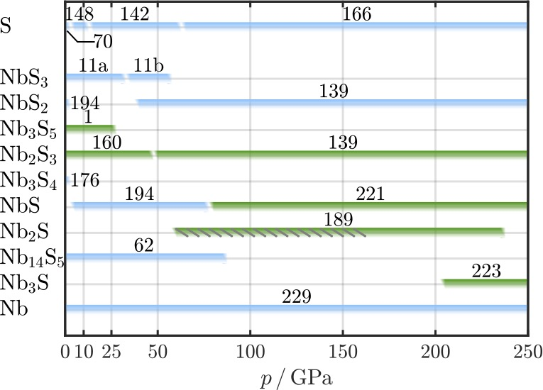
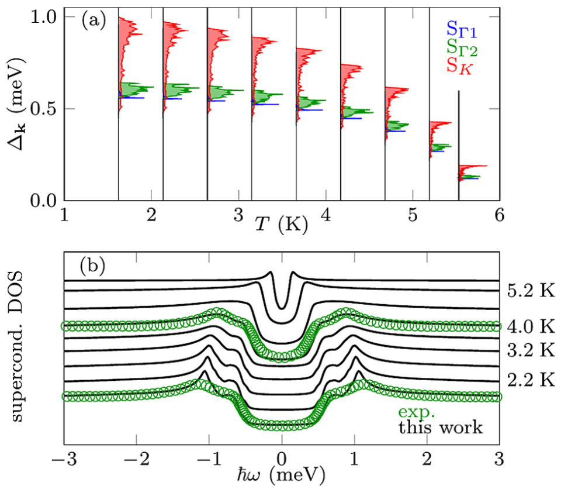
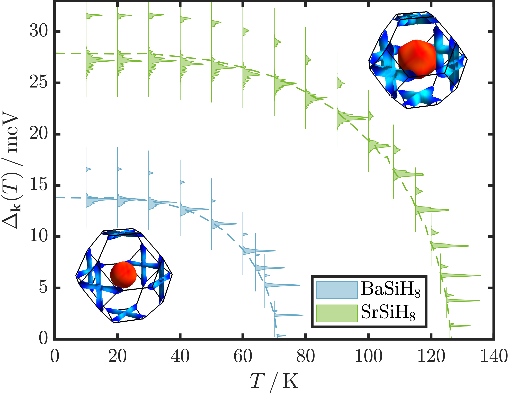
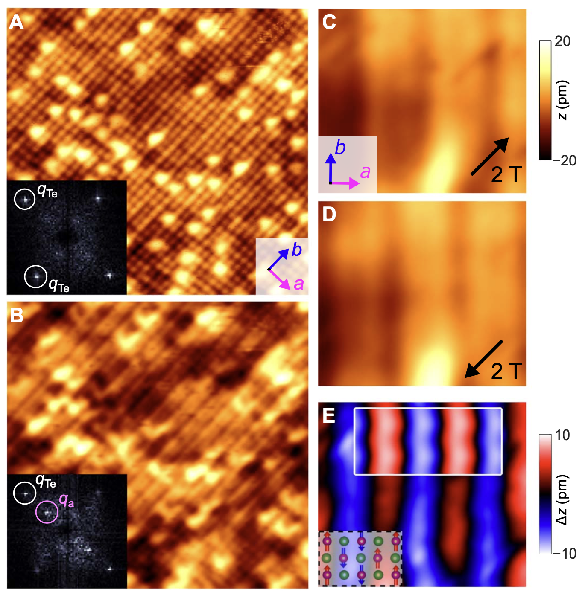

## IsoME: A Julia Package for High-Precision Superconductivity Calculations

{:.clearfix}
{:.rounded .float-left}

We have developed **IsoME**, a Julia package that integrates multiple computational methods for determining superconducting properties with high precision. IsoME unifies various levels of approximation—from the semi-empirical McMillan-Allen-Dynes formula (and its machine learning variant) to fully ab initio calculations based on isotropic Migdal-Eliashberg theory. It supports both constant density-of-states (cDOS) and variable density-of-states (vDOS) approaches, with the option to include static Coulomb interactions.

Designed to accommodate both routine material screening and detailed theoretical investigations, IsoME features an automatic Tc search mode that streamlines high-throughput computations by determining the critical temperature (Tc) without manual temperature specification. The package integrates seamlessly with common DFT/DFPT and GW codes, ensuring compatibility with existing computational workflows. In addition, the IsoME repository includes examples to help users get started quickly.

IsoME is available as an open-source package through multiple platforms:
- **GitHub:** [github.com/cheil/IsoME.jl](https://github.com/cheil/IsoME.jl)
- **JuliaHub:** [juliahub.com/ui/Packages/General/IsoME](https://juliahub.com/ui/Packages/General/IsoME)
- **Zenodo:** [DOI:10.5281/zenodo.14967551](https://zenodo.org/records/14967551)

Further details on the functionality and benchmark tests of IsoME are provided in the accompanying preprint on [arXiv:2503.03559](https://arxiv.org/abs/2503.03559).

## Transition metal chalcogenides under extreme pressure

{:.clearfix}
{:.rounded .float-start}
The aim of this research project is to study the high-pressure phase diagram of transition metal chalcogenides. Combining several fully ab initio and state-of-the-art methods, we are searching for new high-pressure structures, determine electronic and vibrational properties of stable structures, as well as calculate their electron-phonon coupling (EPC), superconducting properties, and instabilities towards charge-density wave (CDW) ordering.

By doing so, this project contributes to obtain a more complete picture of the high-pressure phase diagram of TMCs, providing a solid foundation for future high-pressure research. In addition, the results of this project help to (i) clarify the effects of high-pressure on atomic bonding, (ii) improve the understanding of the mechanisms behind SC and charge order under pressure, and (iii) shed light on the interactions between coexisting SC and CDW order in these materials.

This project is supported by the Austrian Science Fund (FWF) and the figure showing the phase diagram of the Nb-S system is from our publication in the special issue [Emergent Leaders 2020 of the J. Phys.: Condens. Matter.](https://iopscience.iop.org/article/10.1088/1361-648X/abda7a)

## Superconductivity in reduced dimensions

{:.clearfix}
{:.rounded .float-right}
We investigate the superconducting phase in systems with reduced dimensionality, as in two-dimensional transition metal dichalcogenides. Due to their chemical diversity, these materials are of not only of special interest for technological applications, but also for fundamental research, as they display fascinating physical features, i.e., charge-density waves, superconductivity, Mott transitions, etc... It is therefore highly interesting to elucidate the atomic-scale mechanisms underpinning the observed dependences of Tc on various system parameters. See, for example, our publication on this topic in [PRL 119, 087003](https://journals.aps.org/prl/abstract/10.1103/PhysRevLett.119.087003) for more details. This project is supported by the Austrian Science Fund (FWF).

## Superconducting hydrides under high pressure
{:.clearfix}
{:.rounded .float-start}
Due to its low atomic mass leading to high energy vibrational modes, hydrogen has been under consideration for conventional high-Tc superconductivity since 1968 ([Ashcroft, PRL 21, 1748](https://journals.aps.org/prl/abstract/10.1103/PhysRevLett.21.1748)). Metallicity is a prerequisite for superconductivity and while it has not yet been possible to get pure hydrogen in a metallic state experimentally, Drozdov et.al., ([Nature volume 525, pages 73–76](https://www.nature.com/articles/nature14964)) reported superconductivity above 200 K in sulfur-hydride at approx. 200 GPa pressure. Since then the research field of superconducting hydrides has expanded greatly and several new, fascinating highest-Tc superconductors have been investigated in the hunt for room temperature superconductivity at ambient pressures.

This research project is performed in close collaboration with the group of [Prof. Lilia Boeri](https://lboeri.wordpress.com/) at the Sapienza University of Rome and the picture on the right is from one of our recent publications in [npj Comp. Mat. 8, 119 (2022)](https://www.nature.com/articles/s41524-022-00801-y).

## Iron-based superconductors

{:.clearfix}
{:.rounded .float-right}
The class of iron-based superconductors (FeSCs) has caught a lot of attention in the scientific community due to the fact that many of the compounds exhibit high-temperature superconductivity, similar to the cuprates. In contrast to the cuprates, however, their low-energy electronic structure is much more complicated. For many materials among the FeSCs, a single-stripe antiferromagnetic (AFM) order was found experimentally to be the ground state for the parent compounds. When the compounds are doped or pressure is applied, this AFM ordered phase vanishes to the benefit of a superconducting one. The occurrence of the superconducting phase is attributed to the very special low-energy electronic structure of FeSCs. It is a highly interesting question to elucidate the origin and properties of the superconducting state in these materials and a major part of our research is therefore devoted to analyze the electronic and magnetic behavior of FeSCs and their electronic response to perturbations.

For this project, we are working in close contact to the experimental group of [Prof. Peter Wahl](https://wahl.wp.st-andrews.ac.uk/) at the University of St. Andrews. The figure you see on the left is from a recent collaboration, published in [Sci. Adv. 5, 3 (2019) eaav3478](https://www.science.org/doi/10.1126/sciadv.aav3478).
