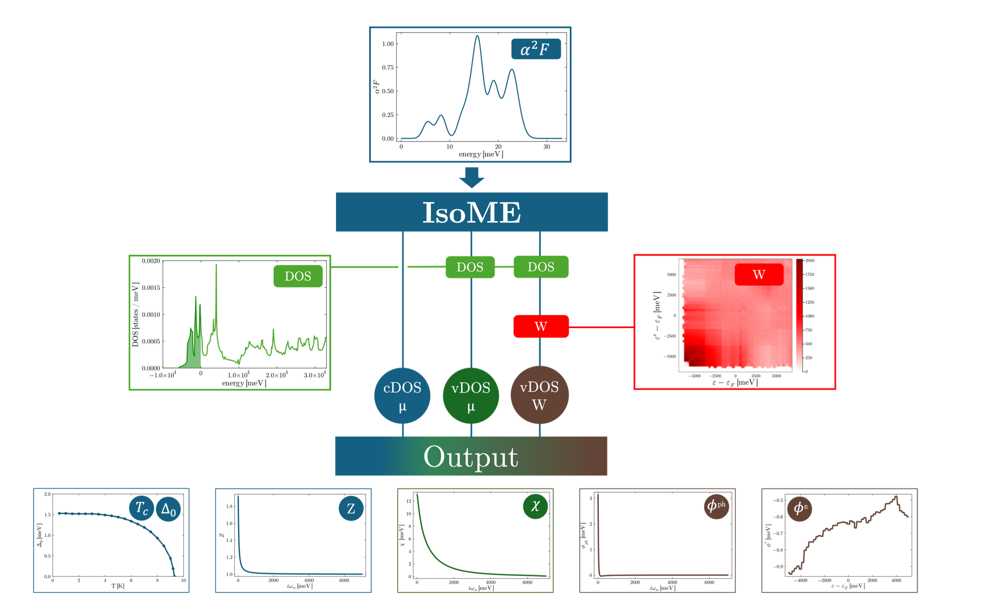
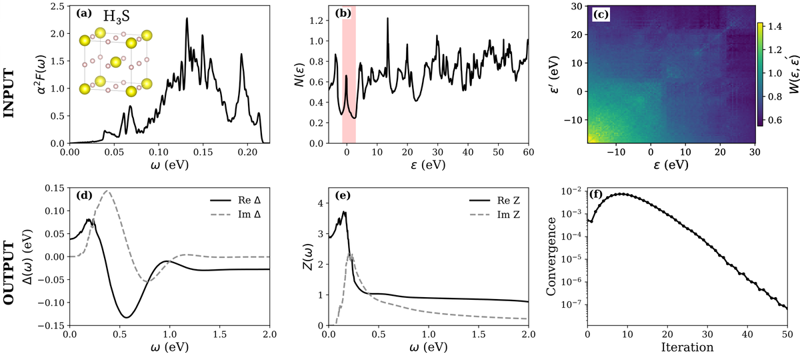
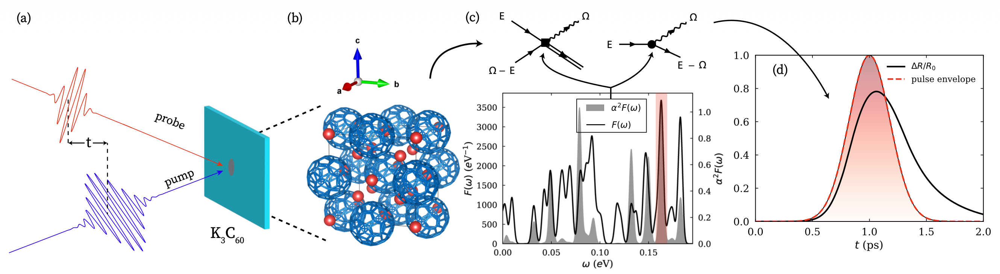
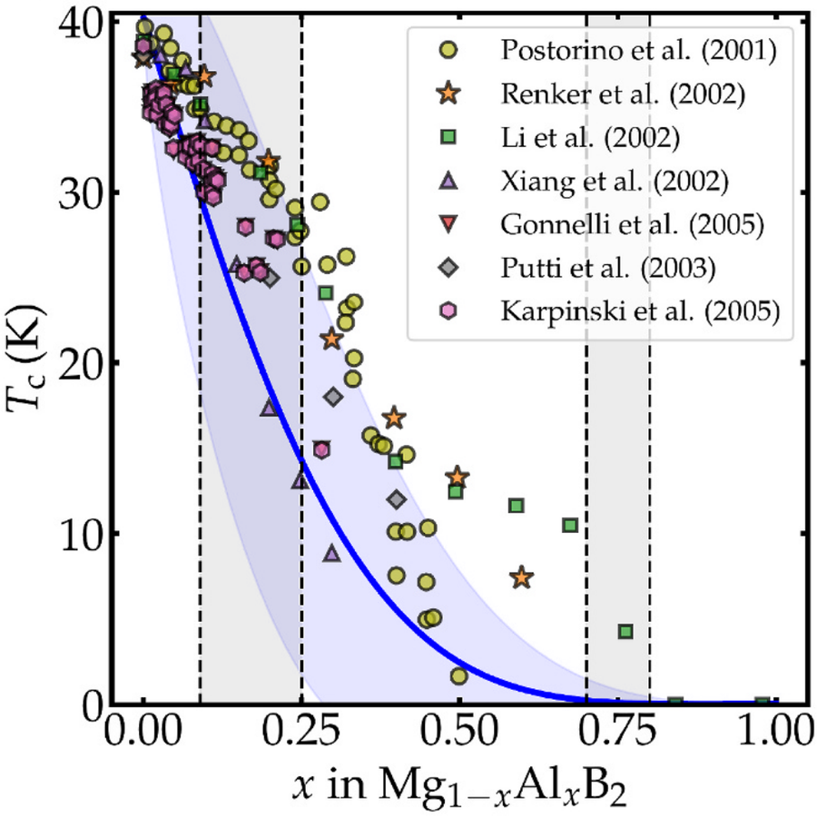
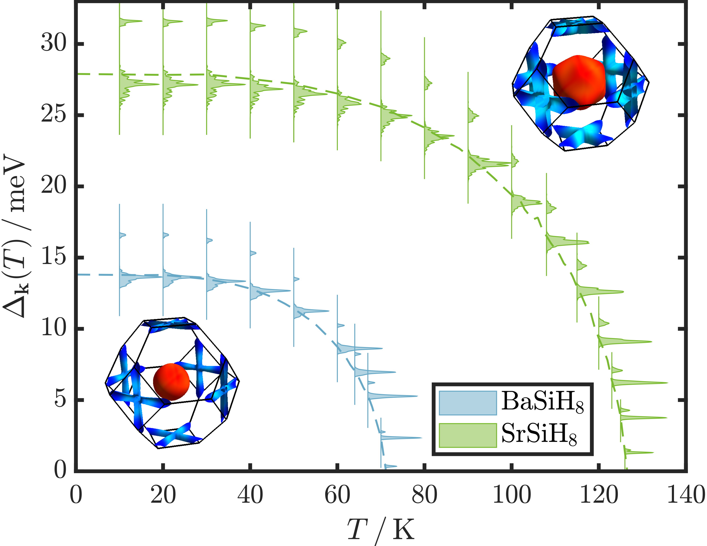
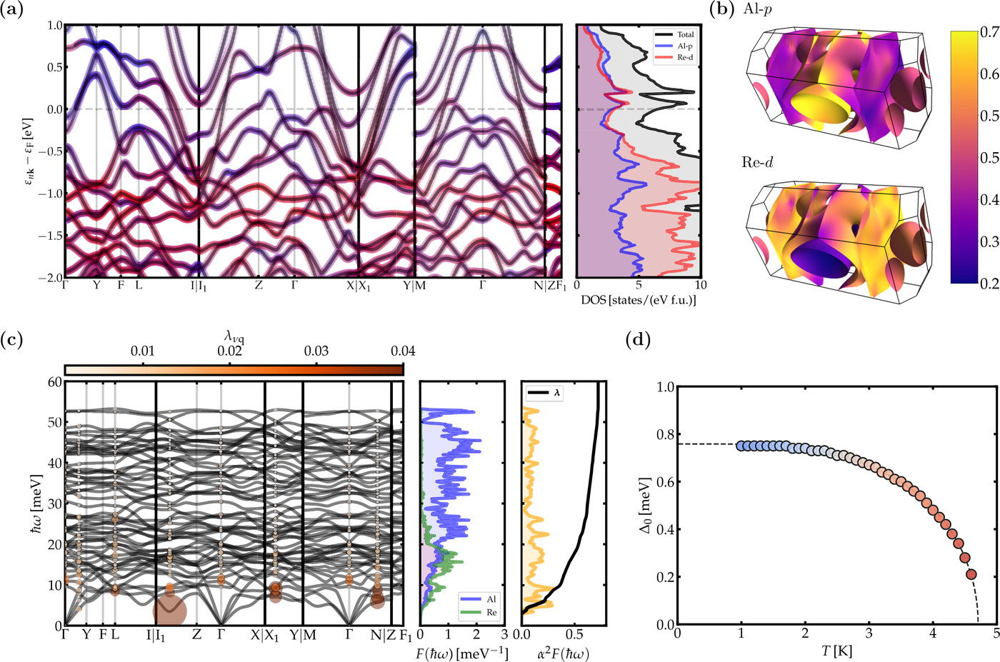

## IsoME: A Julia Package for High-Precision Superconductivity Calculations

{:.clearfix}
{:.rounded .float-left}
We have developed **IsoME**, a Julia package that integrates multiple computational methods for determining superconducting properties with high precision. IsoME unifies various levels of approximation—from the semi-empirical McMillan-Allen-Dynes formula (and its machine learning variant) to fully ab initio calculations based on isotropic Migdal-Eliashberg theory. It supports both constant density-of-states (cDOS) and variable density-of-states (vDOS) approaches, with the option to include static Coulomb interactions.

Designed to accommodate both routine material screening and detailed theoretical investigations, IsoME features an automatic Tc search mode that streamlines high-throughput computations by determining the critical temperature (Tc) without manual temperature specification. The package integrates seamlessly with common DFT/DFPT and GW codes, ensuring compatibility with existing computational workflows. In addition, the IsoME repository includes examples to help users get started quickly.

IsoME is available as an open-source package through multiple platforms:
- **GitHub:** [github.com/cheil/IsoME.jl](https://github.com/cheil/IsoME.jl)
- **JuliaHub:** [juliahub.com/ui/Packages/General/IsoME](https://juliahub.com/ui/Packages/General/IsoME)
- **Zenodo:** [DOI:10.5281/zenodo.14967551](https://zenodo.org/records/14967551)

Further details on the functionality and benchmark tests of IsoME are provided in the accompanying paper on [Computer Physics Communications 315, 109720 (2025)](https://doi.org/10.1016/j.cpc.2025.109720).

### In development: solving Eliashberg theory on the real-frequency axis

{:.clearfix}
{:.rounded .float-right}
Almost everything an experiment actually measures on a superconductor—tunneling spectra, optical conductivity, quasiparticle lifetimes—is a real-frequency quantity. The Migdal-Eliashberg equations, however, are almost always solved on the imaginary (Matsubara) axis and then analytically continued. That continuation is an ill-conditioned inverse problem: it amplifies numerical noise, washes out spectral structure, and becomes increasingly unstable at low temperatures, exactly where the physics is most interesting.

We are currently extending IsoME to bypass this step altogether. Our scheme solves the finite-temperature Eliashberg equations *directly on the real-frequency axis* while retaining the full energy dependence of the electronic density of states—something most real-axis implementations give up in favour of a constant density of states. A reformulation of the integral kernel reduces the cost from O(N&sup2;) to O(N), so high-resolution solutions converge in milliseconds to minutes on a standard laptop ([arXiv:2603.18199](https://arxiv.org/abs/2603.18199)).

Keeping the full bandwidth matters. For H3S, whose van Hove singularity at the Fermi level makes the electronic structure strongly particle-hole asymmetric, the real-axis solution gives a zero-temperature gap of 2&Delta; &asymp; 60 meV, close to recent tunneling measurements, while the constant density of states approximation overshoots at 75 meV. This development builds on our earlier work on [Nevanlinna analytic continuation for Migdal-Eliashberg theory](https://doi.org/10.1016/j.commt.2024.100015) and on the [full-bandwidth anisotropic framework](https://doi.org/10.1038/s42005-024-01528-6) that resolves the gap across the entire Fermi surface. The real-axis solver will be released as part of an upcoming version of IsoME.

## Ultrafast and non-equilibrium superconductivity

{:.clearfix}
{:.rounded}

What happens to a superconductor when you drive it far from equilibrium with a light pulse? We are building a fully *ab initio*, self-consistent framework to answer that quantitatively. Kinetic equations for the quasiparticle distribution *f*(*E*,*t*) and the phonon distribution *n*(&omega;,*t*)—an extension of the Chang-Scalapino equations into the strong-coupling regime—are solved together with the Migdal-Eliashberg equations on the real-frequency axis. Every material-specific ingredient, including the Eliashberg spectral function &alpha;&sup2;*F*(&omega;), comes from density functional (perturbation) theory. The optical response of the driven film then follows from the time-dependent conductivity via a Kubo formula and the Maxwell equations, yielding differential reflectance and transmission that can be compared directly against pump-probe experiments ([arXiv:2603.18182](https://arxiv.org/abs/2603.18182)).

The framework is validated on two superconductors that could hardly be more different: elemental Pb at ambient pressure, with soft phonons and modest coupling, and LaH10 at 165 GPa, where stiff hydrogen vibrations push *T*c to about 250 K. It reproduces the measured temperature dependence in Pb and the multi-timescale relaxation and phonon bottleneck in LaH10.

This lets us address *photo-induced superconductivity*, where mid-infrared pumping of K3C60 has been reported to produce superconducting signatures far above the equilibrium *T*c. We find a prominent peak in &alpha;&sup2;*F*(&omega;) at exactly the 170 meV pump energy, and obtain a transient gap above *T*c—entirely within conventional electron-phonon-mediated superconductivity. A closely related strand applies the same non-equilibrium machinery to [single-photon detection in superconducting nanowire detectors and qubits](https://journals.aps.org/prb/abstract/10.1103/3m2k-mzr6). This work is carried out in close collaboration with the group of [Prof. Karl Berggren](https://qnn-rle.mit.edu/) at MIT's Research Laboratory of Electronics.

## Computational Modeling of Real-World Alloy Superconductors

{:.clearfix}
{:.rounded .float-right}
Textbook calculations assume perfect, ordered, stoichiometric crystals. **Real superconductors**—the ones wound into magnets, deposited as detector films, or patterned into qubits—are alloys: disordered, off-stoichiometric, and full of vacancies. This FWF-funded project, running at TU Graz since 2026, is aimed squarely at closing that gap and turning *ab initio* simulations of conventional superconductors into **real-world predictions**.

The strategy is to treat disorder and thermodynamics on the same footing as the electron-phonon interaction, in a single first-principles framework. It combines FHI-aims for scalable electron-phonon calculations, IsoME for the Migdal-Eliashberg step, and the [extended generalized quasichemical approximation (EGQCA)](https://doi.org/10.1016/j.mtphys.2024.101547) for the thermodynamics of chemical disorder—computing cluster probabilities that minimise the mixing Gibbs free energy while incorporating chemical ordering, lattice distortions, and vibrational contributions. The targets are quantitative predictions of transition temperature, gap, and critical fields for technologically relevant transition-metal alloys such as Nb-N, Nb-C, Ti-N, Nb-Ti-N, and Nb-C-N, moving on to high-entropy alloy superconductors.

The approach is already proving itself across a range of systems. In the substitutional alloy SrTi1-*x*V*x*O3, which interpolates between the band insulator SrTiO3 and the correlated metal SrVO3, we combined the cluster ensemble with dynamical mean-field theory to obtain a miscibility gap with a critical temperature of 1443 K and to reproduce the composition-driven [metal-insulator transition](https://arxiv.org/abs/2607.07067) that density functional theory alone misses—a reminder that the framework is not restricted to superconductors. Elsewhere we have used it to model hydrogen and deuterium vacancies in [SrPdH/D2.9](https://arxiv.org/abs/2602.23691), where compositional variation helps explain the observed inverse isotope effect; to predict [tunable superconductivity](https://doi.org/10.1103/qx58-z229) across the decagonal Al13Os4-*x*Re*x* and Al13Os4-*x*Ir*x* series; and to treat [ternary polyhydride alloys](https://doi.org/10.1002/andp.202500467) such as La1-*x*Y*x*H10 under pressure.

Core tools developed in the project are released as open-source software. The project is supported by the Austrian Science Fund (FWF) and run in close collaboration with Sapienza University of Rome ([Prof. Lilia Boeri](https://lboeri.wordpress.com/)) and the University of Vienna (Prof. Reinhard Maurer).

## In search of novel and improved superconductors

{:.clearfix}
{:.rounded .float-left}
Alongside understanding known superconductors, we look for new ones—and for ways to make existing ones **better**. And "better" is deliberately broader than just a higher *T*c: a material with a higher upper critical field *H*c2, a more robust gap, or one that survives being grown as a real film can matter more for applications than a few extra kelvin. We use IsoME together with machine-learning-assisted screening to scan candidate compositions quickly, then follow up the promising ones with full anisotropic, anharmonic, full-bandwidth calculations.

**Superconducting hydrides under high pressure.** Because of its low atomic mass and correspondingly high-energy vibrational modes, hydrogen has been a candidate for conventional high-*T*c superconductivity since 1968 ([Ashcroft, PRL 21, 1748](https://journals.aps.org/prl/abstract/10.1103/PhysRevLett.21.1748)). Metallicity is a prerequisite, and while metallic hydrogen itself remains out of experimental reach, Drozdov *et al.* ([Nature 525, 73 (2015)](https://www.nature.com/articles/nature14964)) reported superconductivity above 200 K in sulfur hydride at around 200 GPa. The field has expanded enormously since, and hydrides remain the highest-*T*c conventional superconductors known. Much of this work is carried out in close collaboration with the group of [Prof. Lilia Boeri](https://lboeri.wordpress.com/) at Sapienza University of Rome; the figure on the left is from our publication in [npj Comp. Mat. 8, 119 (2022)](https://www.nature.com/articles/s41524-022-00801-y).

**Towards accessible pressures.** A megabar-pressure superconductor is a beautiful result but not a usable material, so a central thread of our work is pushing hydride superconductivity down to pressures that experiments—and eventually applications—can actually reach. Recent examples include the complex transition-metal hydride [Mg4Pt3H6](https://journals.aps.org/prb/abstract/10.1103/PhysRevB.112.094513), stabilised at ambient pressure, and the square-planar [LiSi and LiGe phases](https://doi.org/10.1021/acs.chemmater.5c02061).

{:.clearfix}
{:.rounded .float-right}
**Structurally exotic hosts.** We also ask where else conventional pairing might hide. We recently provided the [first *ab initio* determination of *T*c for a quasicrystal approximant](https://doi.org/10.1103/qx58-z229), reproducing the measured *T*c of Al13Os4 and predicting that Al13Re4 should be roughly 30% higher. Since the approximant preserves the local structural motifs of its parent quasicrystal, this places the Al-Os and Al-Re families among the most promising candidates for quasicrystalline superconductivity found so far.

Our broader view of where this field is heading, and what it would actually take to reach room-temperature superconductivity, is laid out in a recent perspective in [PNAS 123, 11 (2026)](https://doi.org/10.1073/pnas.2520324123).
